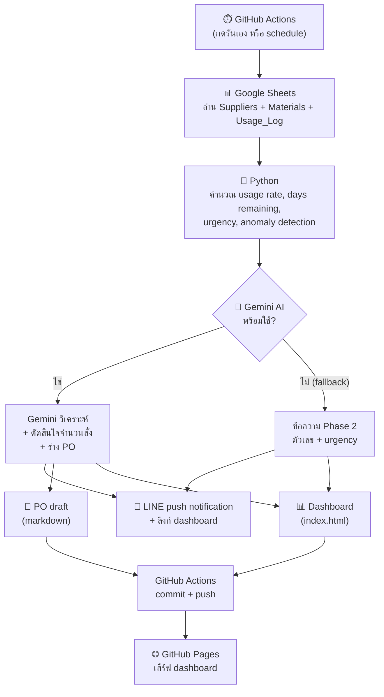

# Inventory Monitor

ระบบเฝ้าระวังสต็อกวัตถุดิบอัตโนมัติ สำหรับธุรกิจขายครีม/อาหารเสริมออนไลน์

อ่านข้อมูลสต็อกจาก Google Sheets → คำนวณอัตราการใช้และวันคงเหลือ → ตรวจจับความผิดปกติ → ใช้ Gemini AI วิเคราะห์สถานการณ์และร่างใบสั่งซื้อ → แจ้งเตือนผ่าน LINE พร้อมลิงก์ Dashboard

🔗 **[ดู Dashboard](https://narathipg.github.io/inventory-monitor/)**

---

## Output ของระบบ

ระบบผลิต output 3 อย่างต่อการรัน 1 ครั้ง:

| Output | รูปแบบ | ไปที่ไหน |
|--------|--------|----------|
| แจ้งเตือนสต็อก | ข้อความภาษาคน + ลิงก์ dashboard | LINE push notification |
| Dashboard | หน้าเว็บ — KPI, กราฟ, ตาราง, anomaly, PO | GitHub Pages |
| ร่างใบสั่งซื้อ (PO) | Markdown แยกตามซัพพลายเออร์ | ไฟล์ใน repo |

### LINE Notification


### Dashboard


## Workflow



### Human in the Loop

- **คนกดรัน** — ระบบไม่ได้รันอัตโนมัติทุกวัน (schedule คอมเมนต์ไว้ เปิดได้เมื่อพร้อม)
- **PO เป็น draft** — ร่างใบสั่งซื้ออยู่ใน repo เป็นไฟล์ markdown ไม่ส่งให้ซัพพลายเออร์อัตโนมัติ
- **คนตัดสินใจ** — อ่าน LINE แล้วตัดสินใจเองว่าจะสั่งซื้อตามที่แนะนำหรือไม่

---

## เทคโนโลยี

| ส่วน | เทคโนโลยี |
|------|-----------|
| ภาษา | Python |
| ข้อมูล | Google Sheets API (gspread + service account) |
| AI | Gemini API (google-genai, โมเดล gemini-3.5-flash) |
| แจ้งเตือน | LINE Messaging API (push message) |
| Dashboard | HTML + Chart.js (static, serverless) |
| Automation | GitHub Actions (workflow_dispatch + schedule) |
| Hosting | GitHub Pages (ฟรี) |

---

## Data Model

3 sheets ใน Google Sheets ออกแบบเป็น dimensional model:

- **Suppliers** (dimension) — 5 ซัพพลายเออร์ มี supplier_id เป็น PK
- **Materials** (dimension) — 8 วัตถุดิบ มี material_id เป็น PK, supplier_id เป็น FK
- **Usage_Log** (fact) — log การเบิก/รับของ มี log_id เป็น PK มีทั้ง IN/OUT

ยอดกระทบตรง: opening_stock + IN - OUT = current_stock ทุกรายการ

---

## Design Decisions

**LLM ตัดสินใจจำนวนสั่งซื้อ** — ตั้งใจ ไม่ใช่บังเอิญ LLM มีบริบททั้ง usage rate, lead time, urgency, anomaly ทำให้แนะนำจำนวนได้ละเอียดกว่า rule-based (เช่น สั่งคงที่ 100 ทุกครั้ง) แต่ยังเป็นแค่คำแนะนำ คนตัดสินใจสุดท้าย

**Single sourcing** — 1 วัตถุดิบ = 1 ซัพพลายเออร์ ลดความซับซ้อนสำหรับ demo ธุรกิจจริงต้องรองรับ multi-sourcing

**Fallback** — ถ้า Gemini ล้มเหลว ระบบยังส่งข้อความ Phase 2 (ตัวเลข + urgency) ได้ ไม่ตาย

**LINE ไม่ใช่ email** — สะท้อนวิธีสื่อสารจริงของธุรกิจไทย โดยเฉพาะ SME

**Static dashboard** — serverless ไม่มีค่าใช้จ่าย ใช้ GitHub Pages ฟรี ไม่ต้องดูแล server

---

## Guardrails

### มีแล้ว
- Prompt สั่ง Gemini ห้าม hallucinate (ห้ามอ้างว่าทำอะไรไปแล้ว เช่น "ประสานงานซัพพลายเออร์แล้ว")
- Prompt สั่งใช้ plain text (LINE ไม่รองรับ markdown)
- Fallback อัตโนมัติเมื่อ Gemini ล้มเหลว
- PO เป็น draft เท่านั้น ไม่ส่งอัตโนมัติ
- Credentials เก็บใน GitHub Secrets ไม่อยู่ในโค้ด
- .gitignore กัน credentials หลุดเข้า repo
- Google Sheets เข้าถึงแบบ read-only

### ยังขาด (รู้ แต่ยังไม่ได้ทำ)
- ไม่มีการตรวจสอบว่าจำนวนที่ Gemini แนะนำสมเหตุสมผลไหม (เช่น สั่ง 999,999 ชิ้น)
- ไม่มี spending limit หรือเพดานจำนวนสั่งซื้อ
- ไม่มี approval workflow ก่อน PO ถูกนำไปใช้จริง
- ไม่มี logging/audit trail นอกจาก git history
- ไม่มี data validation บน Google Sheets

---

## โครงสร้างไฟล์

```
inventory-monitor/
├── .github/workflows/
│   └── monitor.yml          # GitHub Actions workflow
├── .gitignore
├── inventory_monitor.py     # สคริปต์หลัก (Phase 1-4 รวมไฟล์เดียว)
├── requirements.txt
├── index.html               # Dashboard (สร้างอัตโนมัติ)
├── PO_draft.md              # ร่างใบสั่งซื้อ (สร้างอัตโนมัติ)
└── README.md
```
