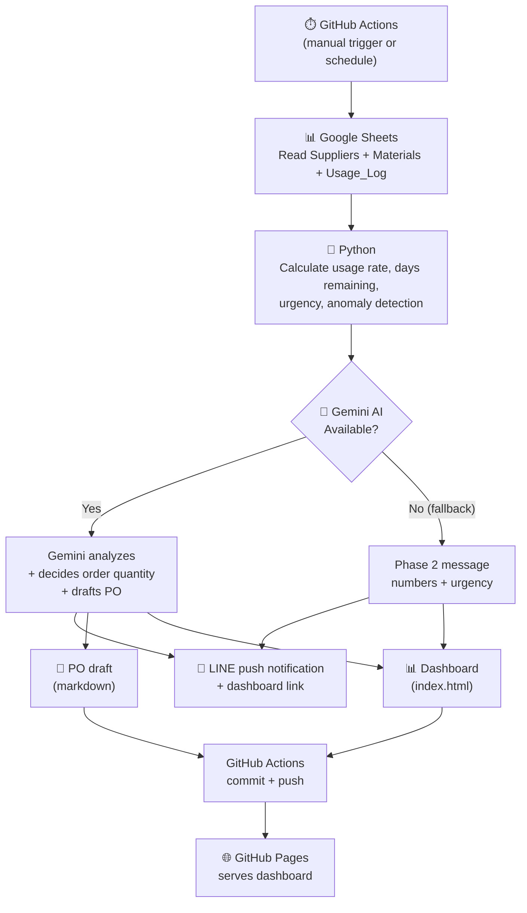

# Inventory Monitor

Automated raw material stock monitoring system for online cosmetics/supplement businesses.

Reads stock data from Google Sheets → calculates usage rates and days remaining → detects anomalies → uses Gemini AI to analyze the situation and draft purchase orders → sends alerts via LINE with a dashboard link.

🔗 **[View Dashboard](https://narathipg.github.io/inventory-monitor/)**

---

## System Output

The system produces 3 outputs per run:

| Output | Format | Destination |
|--------|--------|-------------|
| Stock alert | Human-readable message + dashboard link | LINE push notification |
| Dashboard | Web page — KPIs, charts, tables, anomalies, PO | GitHub Pages |
| Purchase Order draft | Markdown, grouped by supplier | File in repo |

### LINE Notification

<!-- Replace with actual screenshot: drag/drop image here when editing README on GitHub -->
> 📸 *Add LINE notification screenshot here*

### Dashboard

<!-- Replace with actual screenshot -->
> 📸 *Add Dashboard screenshot here*

---

## Workflow



### Human in the Loop

- **Manual trigger** — The system does not run automatically every day (schedule is commented out; can be enabled when ready)
- **PO is a draft** — Purchase order drafts are stored in the repo as markdown files; they are not sent to suppliers automatically
- **Human decides** — Read the LINE alert, then decide whether to follow the recommendation or not

---

## Tech Stack

| Component | Technology |
|-----------|-----------|
| Language | Python |
| Data | Google Sheets API (gspread + service account) |
| AI | Gemini API (google-genai, model: gemini-3.5-flash) |
| Notifications | LINE Messaging API (push message) |
| Dashboard | HTML + Chart.js (static, serverless) |
| Automation | GitHub Actions (workflow_dispatch + schedule) |
| Hosting | GitHub Pages (free) |

---

## Data Model

3 sheets in Google Sheets, designed as a dimensional model:

- **Suppliers** (dimension) — 5 suppliers, supplier_id as PK
- **Materials** (dimension) — 8 materials, material_id as PK, supplier_id as FK
- **Usage_Log** (fact) — stock movement log, log_id as PK, records both IN and OUT

Balances reconcile exactly: opening_stock + IN - OUT = current_stock for every item.

---

## Design Decisions

**LLM decides order quantities** — Intentional, not accidental. The LLM has full context: usage rate, lead time, urgency, anomalies — enabling more nuanced recommendations than rule-based logic (e.g., always ordering a fixed 100 units). The output is still a recommendation only; humans make the final call.

**Single sourcing** — 1 material = 1 supplier. Reduces complexity for demo purposes. A production system would need multi-sourcing support.

**Fallback** — If Gemini fails, the system still sends a Phase 2 message (numbers + urgency). It doesn't break.

**LINE, not email** — Reflects how Thai businesses actually communicate, especially SMEs.

**Static dashboard** — Serverless, zero cost. Hosted on GitHub Pages for free with no server maintenance required.

---

## Guardrails

### Implemented
- Prompt instructs Gemini not to hallucinate (e.g., must not claim actions already taken such as "coordinated with suppliers")
- Prompt instructs Gemini to use plain text (LINE does not support markdown)
- Automatic fallback when Gemini fails
- PO is draft only — never sent automatically
- Credentials stored in GitHub Secrets, not in code
- .gitignore prevents credentials from leaking into the repo
- Google Sheets accessed as read-only

### Known Gaps (acknowledged, not yet addressed)
- No validation on whether Gemini's recommended quantities are reasonable (e.g., ordering 999,999 units)
- No spending limit or order quantity cap
- No approval workflow before a PO draft is acted upon
- No logging/audit trail beyond git history
- No data validation on Google Sheets input

---

## File Structure

```
inventory-monitor/
├── .github/workflows/
│   └── monitor.yml          # GitHub Actions workflow
├── .gitignore
├── inventory_monitor.py     # Main script (Phase 1–4 in a single file)
├── requirements.txt
├── index.html               # Dashboard (auto-generated)
├── PO_draft.md              # Purchase order draft (auto-generated)
└── README.md
```
